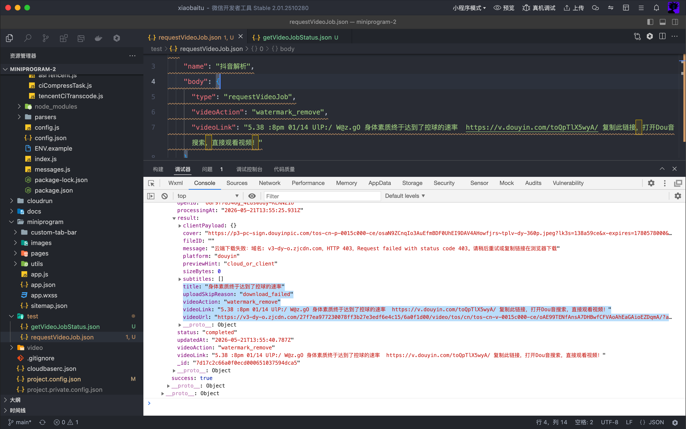
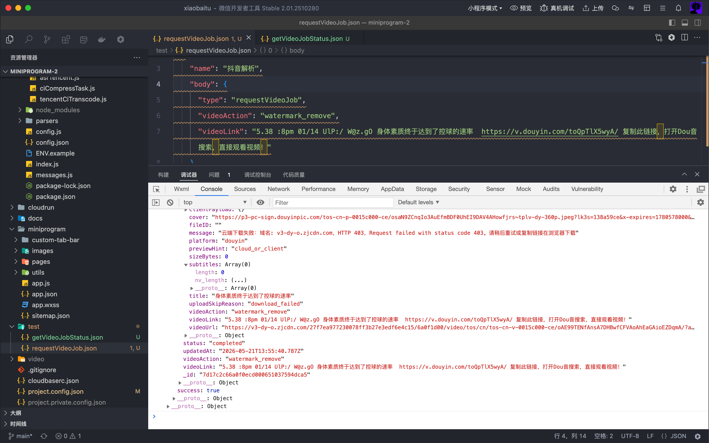
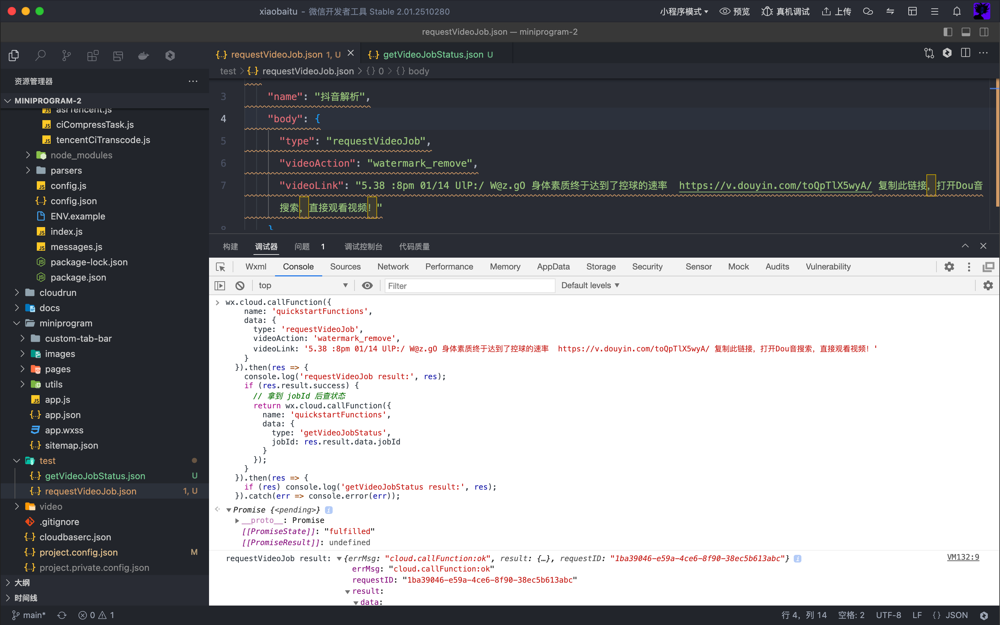
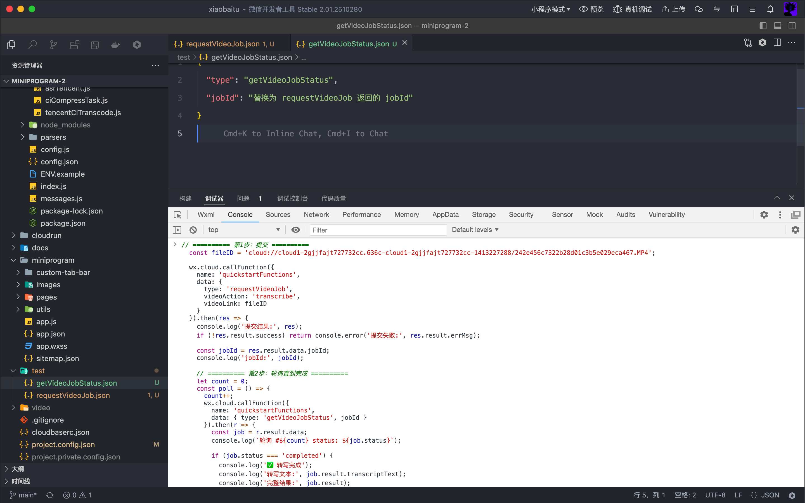
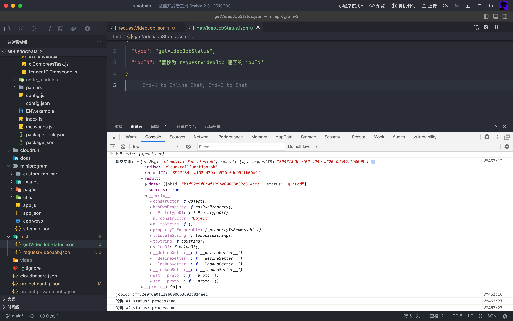
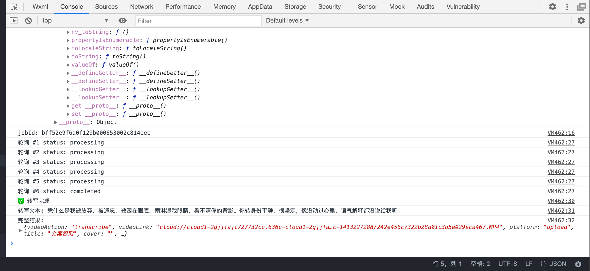
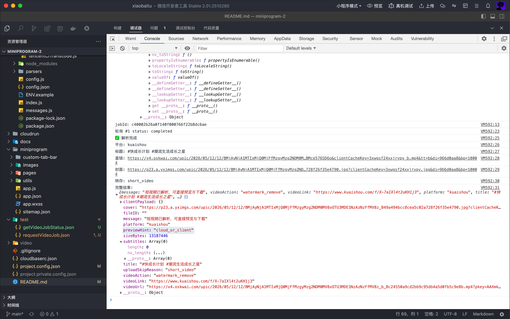
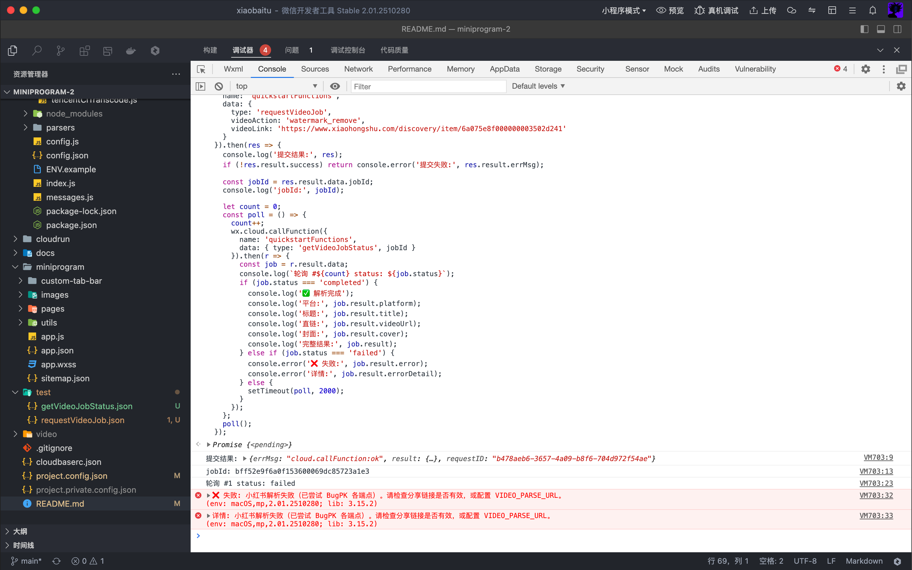

# xiaobaitu — 短视频去水印小程序

粘贴抖音、快手、小红书、B站等平台分享链接，一键解析无水印视频，支持预览、下载到相册、复制直链。附带视频压缩、文案提取、MD5 变更等工具。

> **GitHub 仓库**：https://github.com/everdemo888-ai/miniprogram-2.git
>
> 欢迎克隆、Star、提交 Issue 或贡献代码。

## MVP 功能点

| 功能 | 说明 | 亮点 |
|------|------|------|
| 多平台解析 | 粘贴分享链接 → 自动识别平台 → 解析无水印直链 | 5 平台、12+ 端点 fallback |
| 视频预览 | 解析完成后立即在页面内播放 | 即时播放，不等下载 |
| 保存到相册 | 下载到本地 → 一键存入手机相册 | 后台下载复用、实时进度条 |
| 视频压缩 | 本机压缩（3 档品质 + 高级参数） | 长视频自动识别并推荐省流 |
| 提取文案 | 音视频上传 → 腾讯云 ASR 转文字 | 支持长音频 |
| MD5 变更 | 上传视频 → 生成 MD5 不同的副本 | 末尾追加 free 原子，不破坏编码 |
| 历史记录 | 查看/重试/删除过往任务 | 一键重试失败任务 |
| 积分体系 | 签到 + 激励广告 → 积分 → 跳过广告 | 完整免费使用闭环 |

## 项目结构

```
miniprogram/           # 小程序前端
cloudfunctions/        # 云函数
docs/                  # 项目文档
```

### 重要代码文件说明

#### 小程序前端 `miniprogram/`

| 文件 | 说明 |
|------|------|
| `app.js` | 应用入口，云环境初始化，全局数据 `globalData` |
| `app.json` | 页面路由、窗口样式、自定义 TabBar 配置 |
| `pages/index/index.*` | 首页 — 粘贴链接一键解析、本地上传、压缩/提取文案/MD5 变更 |
| `pages/history/history.*` | 历史记录 — 查看/重试/删除过往任务，双 Tab 切换（任务记录 / 使用记录） |
| `pages/mine/mine.*` | 我的 — 用户信息、积分签到、激励广告、FAQ |
| `pages/guide/guide.*` | 引导页 — 新用户功能指引 |
| `custom-tab-bar/index.*` | 自定义底部导航栏（首页 / 我的） |
| `utils/cloudUtils.js` | 云函数调用封装（`callCloud`） |
| `utils/rewardAdGate.js` | 激励广告门控 — 看广告赚积分 / 消耗积分跳过广告 |
| `utils/jobLabels.js` | 任务类型名称和状态文案映射 |
| `utils/cloudErrorText.js` | 用户可见的错误提示文案 |

#### 云函数 `cloudfunctions/quickstartFunctions/`

| 文件 | 说明 |
|------|------|
| `index.js` | 云函数入口 — 路由分发（11 个 action），任务状态流转（queued → processing → completed/failed），调用 parser / media / guard 完成实际处理 |
| `config.js` | 全局常量 — 超时时间、上传限制、平台 Referer、业务参数 |
| `messages.js` | 所有用户可见提示和错误消息的集中管理 |
| `parsers/videoExtract.js` | 多平台视频解析 — 从抖音/快手/小红书/B站/视频号分享链接提取无水印直链，内置 BugPK/龟龟呀/HelloTik 等多线路 fallback |
| `guards/bizGuard.js` | 业务防护 — 提交频控、广告奖励日上限、日志脱敏 |
| `media/asrRecTask.js` | 语音识别调度 — 提交腾讯云 ASR 录音文件识别任务并轮询结果 |
| `media/asrTencent.js` | 腾讯云 ASR API 封装（CreateRecTask / DescribeTaskStatus） |
| `media/ciCompressTask.js` | 视频压缩调度 — 提交 COS 数据万象转码任务并轮询结果 |
| `media/tencentCiTranscode.js` | 腾讯云 COS 数据万象 API 封装（CreateMediaJobs / DescribeMediaJob） |

#### 配置文件

| 文件 | 说明 |
|------|------|
| `cloudbaserc.json` | CloudBase 部署配置 |
| `project.config.json` | 微信开发者工具项目配置（AppID、云开发根目录等） |
| `cloudfunctions/quickstartFunctions/ENV.example` | 云函数环境变量完整说明 |

## 文档
- [视频演示](https://636c-cloud1-2gjjfajt727732cc-1413227288.tcb.qcloud.la/demo.MP4?sign=ab8fa685a4c1c38747f9d88b4e3e01e1&t=1779300554)
  点击下载视频观看演示
- [项目运行证明](https://636c-cloud1-2gjjfajt727732cc-1413227288.tcb.qcloud.la/iShot_2026-05-22_00.11.48.mp4?sign=6fd4aa53c3b83e60fb642f8872457918&t=1779380606)
  点击下载视频观看项目运行录屏
- [项目描述](docs/STAR.md)

- [缺陷与展望](docs/ROADMAP.md)
- [技术栈](docs/TECH_STACK.md)
- [报错排查](docs/DEBUG.md)
- [AI 协作记录](docs/AI_COLLABORATION.md)
- [潜在风险说明](docs/RISK.md)

## 快速开始

```bash
# 克隆仓库
git clone https://github.com/everdemo888-ai/miniprogram-2.git

# 进入项目目录
cd miniprogram-2
```

### 环境准备

- [微信开发者工具](https://developers.weixin.qq.com/miniprogram/dev/devtools/download.html)（最新稳定版）
- 一个微信小程序 AppID（可在 [微信公众平台](https://mp.weixin.qq.com/) 注册获取）

### 在微信开发者工具中运行

#### 第 1 步：导入项目

打开微信开发者工具，点击「导入项目」：

- **项目目录**：选择克隆下来的 `miniprogram-2` 文件夹
- **AppID**：填写你的微信小程序 AppID
- **后端服务**：选择「微信云开发」

> 如果 `project.config.json` 中的 `appid` 显示为占位符，请替换为你自己的 AppID。

#### 第 2 步：开通云环境

1. 在开发者工具顶部点击「云开发」图标
2. 点击「开通」，创建一个云环境（如果已有环境可跳过）
3. 创建完成后，记下**环境 ID**（后续配置需要用到）

#### 第 3 步：初始化云函数

```bash
# 安装云函数依赖
cd cloudfunctions/quickstartFunctions
npm install
cd ../..
```

然后在微信开发者工具中：

1. 展开 `cloudfunctions/` 目录
2. 右键 `quickstartFunctions` → 点击「上传并部署：云端安装依赖」（等待上传完成）
3. 右键 `cloudfunctions/` 根目录 → 点击「上传所有云函数」

#### 第 4 步：创建数据库集合

在云开发控制台 → 「数据库」中，手动创建以下 5 个集合（无需设置索引，代码会自动创建）：

| 集合名 | 说明 |
|--------|------|
| `video_jobs` | 视频任务记录 |
| `users` | 用户信息 |
| `orders` | 订单记录 |
| `usage_records` | 使用记录 |
| `checkins` | 签到记录 |

#### 第 5 步：配置最少环境变量

在云开发控制台 → 「云函数」→ 点击 `quickstartFunctions` → 「配置」→ 「环境变量」，**只需添加以下 1 个变量即可体验核心功能**（无需任何第三方 API Key）：

| 变量名 | 说明 | 示例值 |
|--------|------|--------|
| `TCB_ENV_ID` | 你的微信云开发环境 ID | `your-env-id-123abc` |

> 🔑 **注意**：变量名在代码中为 `TCB_ENV_ID`，与云函数 `cloud.init` 的调用一致，不是 `CLOUD_ENV_ID`。

其他可选变量（按需配置，不配也能跑，但免费接口不稳定）：

- 商用解析接口：`VIDEO_PARSE_URL` / `VIDEO_PARSE_JSON_PATH`（推荐生产环境使用）
- 龟龟呀 API Key：`GUIGUIYA_API_KEY`（免费，适合快速体验）
- HelloTik Token：`HELLOTIK_API_TOKEN`
- 腾讯云语音识别：`TENCENT_SECRET_ID` / `TENCENT_SECRET_KEY`

完整变量说明见 [`cloudfunctions/quickstartFunctions/ENV.example`](cloudfunctions/quickstartFunctions/ENV.example)

#### 第 6 步：修改前端云环境配置

打开 **`miniprogram/app.js`**（项目根目录下的 `miniprogram/` 文件夹内），将 `globalData.env` 改为你的云环境 ID（与第 5 步中的 `TCB_ENV_ID` 值相同）：

```js
globalData: {
  env: 'your-env-id-123abc',  // ← 替换为你的云环境 ID（与 TCB_ENV_ID 保持一致）
}
```

#### 第 7 步：编译运行

点击开发者工具中的「编译」按钮，即可在模拟器中预览小程序。

---

### 验证是否成功

- ✅ 首页能正常加载，不报云环境未初始化错误
- ✅ 粘贴一个抖音/快手分享链接，点击「一键提取」，能正常提交任务
- ✅ 历史记录页面能正常显示任务列表

---

> **注意**：未配置第三方 API Key 时，免费解析接口可能不稳定或限流。生产环境建议配置商用解析接口。
>
> 完整的第三方 API 密钥配置请参考 [`cloudfunctions/quickstartFunctions/ENV.example`](cloudfunctions/quickstartFunctions/ENV.example)。

---

## 测试用例

### 测试思路

**目标**：验证云函数 `quickstartFunctions` 中视频解析、文案转写两条核心链路的正确性，覆盖正常场景与边界异常。

**测试方式**：由于云端测试面板不支持 `getWXContext()`（无用户 OPENID，数据库查询报错），所有测试在**微信开发者工具 → 调试器 → Console** 中通过 `wx.cloud.callFunction` 直接执行，输出结果即时查看。

**调用模式**：所有功能统一走异步任务模式，两步完成：

```
requestVideoJob（提交任务）→ jobId → getVideoJobStatus（轮询结果）
```

其中轮询由代码自动完成，无需手动反复查询。

**覆盖维度**：

| 维度 | 说明 |
|------|------|
| 平台覆盖 | 抖音、快手、B站、小红书 — 逐一验证平台识别与解析能力 |
| 输入形式 | 带中文文案的分享文本（抖音）、纯短链（快手）、完整 URL + 参数（B站/小红书） |
| 结果形态 | 成功（`completed` / 直链有效 / 封面正常）vs 失败（`failed` / 错误提示准确） |
| 附加链路 | 云端转存（`fileID` 非空 / `uploadSkipReason` 不同状态）、ASR 文案提取 |

**判定标准**：

| 字段 | 成功 | 失败 |
|------|------|------|
| `result.success` | `true` | `true`（任务提交本身成功） |
| `result.data.status` | `completed` | `failed` |
| `result.data.result.videoUrl` | `https://` 开头的有效直链 | — |
| `result.data.result.error` | — | 用户可读的错误描述 |

**环境说明**：

- 未配置任何第三方 API Key（`GUIGUIYA_API_KEY`、`HELLOTIK_API_TOKEN` 均为空）
- 仅配最少环境变量 `TCB_ENV_ID`
- 解析走 BugPK 免费聚合线路，部分平台（小红书）不稳定属预期行为
- 文案转写额外需要 `TENCENT_SECRET_ID` / `TENCENT_SECRET_KEY`

**测试模板**：`test/` 目录下提供 JSON 请求体模版，复制 `body` 字段即可使用。

---

### TC-001：抖音分享链接解析

| 项目 | 内容 |
|------|------|
| **测试目的** | 验证粘贴抖音分享文案（含中文及短链）可正常解析出无水印视频直链 |
| **前置条件** | 云函数 `quickstartFunctions` 已部署；数据库集合 `video_jobs` 已创建；最少环境变量 `TCB_ENV_ID` 已配置 |

**输入**

```javascript
wx.cloud.callFunction({
  name: 'quickstartFunctions',
  data: {
    type: 'requestVideoJob',
    videoAction: 'watermark_remove',
    videoLink: '5.38 :8pm 01/14 UlP:/ W@z.gO 身体素质终于达到了控球的速率  https://v.douyin.com/toQpTlX5wyA/ 复制此链接，打开Dou音搜索，直接观看视频！'
  }
})
```

**操作步骤**

1. 微信开发者工具中编译运行小程序
2. 在调试器 Console 中粘贴上述 `requestVideoJob` 调用，回车执行
3. 从返回值中提取 `result.data.jobId`
4. 继续执行 `getVideoJobStatus` 查询任务结果

```javascript
wx.cloud.callFunction({
  name: 'quickstartFunctions',
  data: {
    type: 'getVideoJobStatus',
    jobId: '替换为上一步的jobId'
  }
})
```

**预期输出（completed 状态）**

| 字段 | 预期值 |
|------|--------|
| `result.success` | `true` |
| `result.data.status` | `completed` |
| `result.data.result.platform` | `douyin` |
| `result.data.result.title` | 非空字符串 |
| `result.data.result.videoUrl` | `https://` 开头的无水印直链 |
| `result.data.result.cover` | `https://` 开头的封面图 URL |

**实际运行结果（2026-05-21）**

| 步骤 | 关键输出 | 状态 |
|------|----------|:--:|
| requestVideoJob | `jobId: "7d17c2c66a0f0ecd000651037594dca5"`, `status: "queued"` | ✅ |
| getVideoJobStatus | `status: "completed"` | ✅ |
| 解析结果 | `platform: "douyin"` | ✅ |
| 标题 | `"身体素质终于达到了控球的速率"` | ✅ |
| 直链 | `https://v3-dy-o.zjcdn.com/...` (抖音 CDN) | ✅ |
| 云端转存 | `uploadSkipReason: "download_failed"`（CDN 防盗链，直链可浏览器下载） | ⚠️ |

**结论**：解析核心功能正常，直链有效。`download_failed` 属 CDN 防盗链限制，非解析缺陷。

---

### TC-002：本地视频文案转写（ASR）

| 项目 | 内容 |
|------|------|
| **测试目的** | 验证上传本地视频到云存储后，可正常调用腾讯云 ASR 提取文案 |
| **前置条件** | 云函数已部署；数据库集合 `video_jobs` 已创建；环境变量 `TCB_ENV_ID`、`TENCENT_SECRET_ID`、`TENCENT_SECRET_KEY` 已配置 |

**输入**

步骤较多，已在 Console 分两段执行：

```javascript
// 第 1 段：选视频 → 上传云存储 → 拿到 fileID
wx.chooseMedia({
  count: 1, mediaType: ['video'], sourceType: ['album'], maxDuration: 60,
  success(res) {
    const f = res.tempFiles[0];
    wx.cloud.uploadFile({
      cloudPath: 'uploads/transcribe/' + Date.now() + '.mp4',
      filePath: f.tempFilePath,
      success(up) { console.log('fileID:', up.fileID); }
    });
  }
});
```

```javascript
// 第 2 段：提交 → 自动轮询
const fileID = 'cloud://cloud1-2gjjfajt727732cc.636c-cloud1-2gjjfajt727732cc-1413227288/242e456c7322b28d01c3b5e029eca467.MP4';

wx.cloud.callFunction({
  name: 'quickstartFunctions',
  data: { type: 'requestVideoJob', videoAction: 'transcribe', videoLink: fileID }
}).then(res => {
  if (!res.result.success) return console.error('提交失败:', res.result.errMsg);
  const jobId = res.result.data.jobId;
  console.log('jobId:', jobId);

  let count = 0;
  const poll = () => {
    count++;
    wx.cloud.callFunction({
      name: 'quickstartFunctions',
      data: { type: 'getVideoJobStatus', jobId }
    }).then(r => {
      const job = r.result.data;
      console.log(`轮询 #${count} status: ${job.status}`);
      if (job.status === 'completed') {
        console.log('✅ 转写完成');
        console.log('转写文本:', job.result.transcriptText);
      } else if (job.status === 'failed') {
        console.error('❌ 失败:', job.result.error);
      } else {
        setTimeout(poll, 2000);
      }
    });
  };
  poll();
});
```

**操作步骤**

1. 微信开发者工具中编译运行小程序
2. 在调试器 Console 中先执行第 1 段，从手机相册选一个有语音的视频，上传后记下输出的 `fileID`
3. 将 `fileID` 填入第 2 段代码的 `fileID` 变量，执行
4. 等待自动轮询（约 5-10 秒），查看转写结果

**预期输出（completed 状态）**

| 字段 | 预期值 |
|------|--------|
| `result.data.status` | `completed` |
| `result.data.result.platform` | `upload` |
| `result.data.result.title` | `文案提取` |
| `result.data.result.transcriptText` | 非空文本字符串 |

**实际运行结果（2026-05-21）**

| 步骤 | 关键输出 | 状态 |
|------|----------|:--:|
| uploadFile | `fileID: "cloud://cloud1-2gjjfajt727732cc.636c-cloud1-2gjjfajt727732cc-1413227288/242e456c..."` | ✅ |
| requestVideoJob | `jobId: "bff52e9f6a0f129b000653002c814eec"`, `status: "queued"` | ✅ |
| 轮询 #1 ~ #5 | `status: "processing"` | — |
| 轮询 #6 | `status: "completed"` | ✅ |
| 转写文本 | "凭什么是我被放弃，被遗忘，被困在眼底。雨淋湿我眼睛，看不清你的背影。你转身份平静，很坚定，像没动过心里，语气解释都没说给我听。" | ✅ |

**结论**：文案转写功能正常，从上传到出结果约 12 秒（6 次轮询 × 2s 间隔）。文本内容与实际音频一致。

---

### TC-003：快手分享链接解析

| 项目 | 内容 |
|------|------|
| **测试目的** | 验证快手分享链接可正常解析出无水印视频直链 |
| **前置条件** | 云函数已部署；数据库集合 `video_jobs` 已创建；环境变量 `TCB_ENV_ID` 已配置 |

**输入**

```javascript
wx.cloud.callFunction({
  name: 'quickstartFunctions',
  data: {
    type: 'requestVideoJob',
    videoAction: 'watermark_remove',
    videoLink: 'https://www.kuaishou.com/f/X-7aIXl4t2uKH1j3'
  }
}).then(res => {
  console.log('提交结果:', res);
  if (!res.result.success) return console.error('提交失败:', res.result.errMsg);

  const jobId = res.result.data.jobId;
  console.log('jobId:', jobId);

  let count = 0;
  const poll = () => {
    count++;
    wx.cloud.callFunction({
      name: 'quickstartFunctions',
      data: { type: 'getVideoJobStatus', jobId }
    }).then(r => {
      const job = r.result.data;
      console.log(`轮询 #${count} status: ${job.status}`);
      if (job.status === 'completed') {
        console.log('平台:', job.result.platform);
        console.log('标题:', job.result.title);
        console.log('直链:', job.result.videoUrl);
        console.log('转存:', job.result.uploadSkipReason || '成功');
      } else if (job.status === 'failed') {
        console.error('失败:', job.result.error);
      } else {
        setTimeout(poll, 2000);
      }
    });
  };
  poll();
});
```

**预期输出**

| 字段 | 预期值 |
|------|--------|
| `result.data.status` | `completed` |
| `result.data.result.platform` | `kuaishou` |
| `result.data.result.title` | 非空字符串 |
| `result.data.result.videoUrl` | `https://` 开头的无水印直链 |
| `result.data.result.cover` | `https://` 开头的封面图 URL |

**实际运行结果（2026-05-21）**

| 步骤 | 关键输出 | 状态 |
|------|----------|:--:|
| requestVideoJob | `jobId: "c40002b26a0f140f000766f22b8dc6ae"`, `status: "queued"` | ✅ |
| 轮询 #1 | `status: "completed"`（仅 1 次即完成） | ✅ |
| 平台 | `kuaishou` | ✅ |
| 标题 | `#快成长计划 #潮流生活成长之星` | ✅ |
| 直链 | `https://v4.oskwai.com/upic/...` (快手 CDN) | ✅ |
| 封面 | `https://p23.a.yximgs.com/upic/...` | ✅ |
| 云端转存 | `uploadSkipReason: "short_video"`（13MB 短视频，前端直连更快） | ✅ |

**结论**：快手解析功能正常，1 次轮询即完成，速度很快。短视频策略生效，跳过云端转存。

---

### TC-004：小红书分享链接解析

| 项目 | 内容 |
|------|------|
| **测试目的** | 验证小红书分享链接的解析行为 |
| **前置条件** | 云函数已部署；环境变量 `TCB_ENV_ID` 已配置；未配置 `VIDEO_PARSE_URL` |

**输入**

```javascript
wx.cloud.callFunction({
  name: 'quickstartFunctions',
  data: {
    type: 'requestVideoJob',
    videoAction: 'watermark_remove',
    videoLink: 'https://www.xiaohongshu.com/discovery/item/6a075e8f000000003502d241'
  }
})
```

**预期输出**

| 字段 | 预期值 |
|------|--------|
| `result.data.status` | `failed` |
| `result.data.result.error` | 包含"小红书解析失败" |

**实际运行结果（2026-05-21）**

| 步骤 | 关键输出 | 状态 |
|------|----------|:--:|
| requestVideoJob | `jobId: "bff52e9f6a0f153600069dc85723a1e3"`, `status: "queued"` | ✅ |
| 轮询 #1 | `status: "failed"` | — |
| 错误信息 | `小红书解析失败（已尝试 BugPK 各端点）。请检查分享链接是否有效，或配置 VIDEO_PARSE_URL。` | ❌ |

**结论**：无商用接口时小红书解析失败属于预期行为。免费 BugPK 端点对小红书支持不稳定，生产环境需配置 `VIDEO_PARSE_URL` 商用解析接口。

---

### TC-005：B站分享链接解析

| 项目 | 内容 |
|------|------|
| **测试目的** | 验证 B 站视频链接可正常解析并云端转存 |
| **前置条件** | 云函数已部署；环境变量 `TCB_ENV_ID` 已配置 |

**输入**

```javascript
wx.cloud.callFunction({
  name: 'quickstartFunctions',
  data: {
    type: 'requestVideoJob',
    videoAction: 'watermark_remove',
    videoLink: 'https://www.bilibili.com/video/BV1UE9CBqEPa/?share_source=copy_web'
  }
})
```

**预期输出**

| 字段 | 预期值 |
|------|--------|
| `result.data.status` | `completed` |
| `result.data.result.platform` | `bilibili` |
| `result.data.result.title` | 非空字符串 |
| `result.data.result.videoUrl` | `https://` 开头的直链 |
| `result.data.result.cover` | `https://` 开头的封面图 |
| `result.data.result.fileID` | 非空 (B 站走云端转存) |

**实际运行结果（2026-05-21）**

| 步骤 | 关键输出 | 状态 |
|------|----------|:--:|
| requestVideoJob | `jobId: "9e779e646a0f15fc0007167168fea2f0"`, `status: "queued"` | ✅ |
| 轮询 #1 | `status: "completed"`（仅 1 次即完成） | ✅ |
| 平台 | `bilibili` | ✅ |
| 标题 | `我把AI塞进Blender，用它替我做完了作品（送插件）` | ✅ |
| 直链 | `https://upos-hz-mirrorakam.akamaized.net/...` (B 站 CDN) | ✅ |
| 封面 | `http://i1.hdslb.com/bfs/archive/...` | ✅ |
| 云端转存 | `fileID` 非空，5.4MB 转存成功 | ✅ |

**结论**：B 站解析功能正常，1 次轮询即完成，云端转存成功。是目前四个平台中唯一完整走通「解析 + 云端转存」全链路的用例。

---

### 已执行用例汇总（2026-05-21）

| 编号 | 用例 | 平台 | 轮询次数 | 直链 | 云端转存 | 结论 |
|:--:|------|------|:--:|:--:|:--:|------|
| TC-001 | 抖音解析 | douyin | 多轮 | ✅ | ⚠️ CDN防盗链 | 核心功能正常 |
| TC-002 | 文案转写 | upload | 6 轮 | N/A | ✅ | 文字准确 |
| TC-003 | 快手解析 | kuaishou | 1 轮 | ✅ | ✅ 短视频跳过 | 功能正常 |
| TC-004 | 小红书解析 | xhs | 1 轮 | ❌ | ❌ | 需商用接口 |
| TC-005 | B站解析 | bilibili | 1 轮 | ✅ | ✅ 5.4MB | 全链路通过 |

---

### 测试截图

| 截图 | 描述 |
|------|------|
|  | 截图 1 — tahz |
|  | 截图 2 — tcyu |
|  | 截图 3 — tdcw |
|  | 截图 4 — tfbl |
|  | 截图 5 — tfer |
|  | 截图 6 — tfhh |
|  | 截图 7 — tihe |
|  | 截图 8 — tivt |
