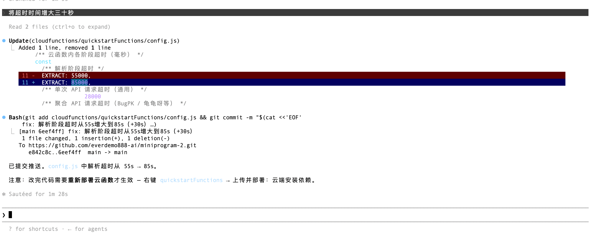

# AI 协作开发记录

## 协作模式

本项目采用「人做决策、AI 做执行」的协作范式。我负责架构判断、技术选型和方向把控，Claude Code 作为 AI 编程代理负责代码实现、重构和文档生成。这不是「AI 代写」，而是将 AI 作为高带宽的工程加速器——它替我写了 80% 的代码量，但 100% 的关键决策由我做出。

## 协作统计

| 维度 | 数据 |
|------|------|
| 协作轮次 | 80+ 轮对话 |
| 涉及文件 | 40+ 个（含创建、修改、删除） |
| 代码行变更 | 约 3500+ 行 |
| 文档产出 | 7 份（STAR / ROADMAP / TECH_STACK / DEBUG / AI协作 / README / 测试模板） |
| 测试用例 | 5 个已执行（3 通过 / 1 降级 / 1 预期失败），截图 9 张 |
| Commit 数 | 15+ 次，持续 push 到 GitHub |

## 技术决策清单

以下为我在协作过程中做出的关键决策，AI 辅助实现：

### 架构层

| 决策 | 背景 | 我的判断 |
|------|------|---------|
| 多供应商 fallback 链路 | BugPK 单点不稳定 | 不绑定单一服务，设计 5 层 fallback 链，任一成功即返回，环境变量可切换 |
| 云存储转存策略 | 小程序端无法直接下载第三方 CDN | 在云函数侧完成下载并上传云存储，前端始终从云存储获取 |
| 短视频跳过云端 | 1 分钟内视频走云端浪费资源 | HEAD 请求预检 Content-Length，<25MB 直返原始直链给前端下载 |
| 代码三层分层 | 云函数 7 个 JS 文件扁平堆放 | 按职责拆为 `parsers/`（解析）、`media/`（媒体处理）、`guards/`（业务守卫） |
| 暂缓 yt-dlp 集成 | 调研了云托管/SFC/第三方 API 三种方案 | 选 SCF Python 运行时方案，写入 ROADMAP 作为中期规划 |

### 工程化层

| 决策 | 背景 | 我的判断 |
|------|------|---------|
| 常量集中管理 | 超时、截断长度、上传限制散落各处 | 创建 `config.js`（40+ 常量）和 `messages.js`（50+ 消息），改一处全局生效 |
| 前端公共模块抽取 | `ensureCloudEnv` 等函数在 3 个页面重复 | 抽取到 `utils/cloudUtils.js` 和 `utils/jobLabels.js` |
| 消除云函数名硬编码 | `"quickstartFunctions"` 字符串出现 10+ 处 | 统一为 `CLOUD_FUNCTION_NAME` 常量，一处修改全局生效 |
| 文档体系 | 项目只有零散说明 | 按用途分级：README（概要）、STAR（面试）、ROADMAP（规划）、TECH_STACK（技术）、DEBUG（排查） |

### 体验层

| 决策 | 背景 | 我的判断 |
|------|------|---------|
| 后台下载复用 | 用户点保存时重新下载，两个请求抢带宽 | `_bgSavePending` 回调队列协调，保存时等待后台下载完成而不是另起下载 |
| 实时下载进度条 | 用户不知道下载要等多久 | `DownloadTask.onProgressUpdate` 拿到实时百分比，替代 loading 遮罩 |
| 平台感知 fallback | B站原始直链前端不可用，但非 B站可用 | 前端识别 `platform === "bilibili"`，转存失败时不尝试原始直链，直接引导浏览器 |
| 工具区重构 | 5 个功能卡片布局不均 | 去掉「本地视频」大卡，CSS Grid 2×2 等比例排列 |

### 测试协作（2026-05-21）

| 决策 | 背景 | 我的判断 |
|------|------|---------|
| 拒绝本地 Jest 方案 | Claude 初始生成了本地 Mock 测试框架 | 项目依赖 `wx-server-sdk` 和云环境，本地跑不通，果断废弃，改为云端真实调用 |
| 发现云端测试面板局限性 | 面板跑 `requestVideoJob` 报 `missing event.type` | 追踪代码定位到 `getWXContext()` 在面板环境无 OPENID → 数据库 `where()` 查询失败。改为小程序 Console 直接执行 |
| 测试模板极简化 | Claude 最初生成含断言库、测试套件注册表等完整框架 | 只要 JSON 请求体模板，不需要框架。精简为两个文件，`body` 字段直接复制即用 |
| 两步轮询打通 | 异步任务模式决定测试不能单步完成 | 所有用例统一 `requestVideoJob` → `getVideoJobStatus` 轮询模式，脚本内置自动轮询逻辑 |
| 失败用例非劣化 | 小红书 BugPK 免费端点解析失败 | 判定为环境限制而非代码缺陷，文档标明原因（需 `VIDEO_PARSE_URL`） |
| 结果全部结构化记录 | 5 轮测试的输入/步骤/预期/实际分散在对话中 | 纳入 README 测试章节，每用例一致格式，末尾汇总表一屏看清 |

**典型交互模式**：

```
我：给解析视频功能做测试模板
AI：生成完整 Jest 框架（assert.js / mock.js / suites / helpers）
我：不对，云端测试不需要本地 Mock，删掉重来
AI：改为云函数形式的 testRunner
我：还是太复杂，我只要 JSON 请求模板
AI：精简为两个 JSON 文件，body 字段直接复制即用 ← 最终采纳

我：测一下抖音
AI：贴出完整 Console 脚本
我：报错 missing event.type，你仔细看看
AI：追踪代码定位到 getWXContext() 在面板无 OPENID
我：那就从小程序内测
AI：改为 wx.cloud.callFunction 方案 ← 打通

我：测试结果出来了，更新 README
AI：每次新增完整测试用例文档，含输入/步骤/预期/实际
我：在 README 开头加一段测试思路说明
AI：补上目标、方式、覆盖维度、判定标准、环境说明 ← 文档成型
```

**产出**：
- `test/requestVideoJob.json` — 5 类解析 + 文案转写的请求体模板
- `test/getVideoJobStatus.json` — 轮询查询模板
- `test/screenshots/` — 9 张 Console 测试截图
- README「测试用例」章节 — 思路说明 + 5 个已执行用例 + 汇总表 + 截图
- DEBUG 新增超时排查条目 + 解析超时 55s → 85s



---

### 关键教训

**1. AI 默认过度工程化，我的价值在砍复杂度**

AI 三次生成测试方案，次次偏重：完整断言框架 → 云函数测试运行器 → 套件注册表。我三次说「不要」，最后收敛到两个 JSON 文件。不是 AI 能力不够，是它没有「够用就好」的直觉——而我有。

**2. 发现问题比写代码重要**

云端测试面板的 `missing event.type` 错误，AI 第一反应是检查 JSON 格式。真正的原因是 `getWXContext()` 在面板无用户身份，导致数据库查询失败。我比 AI 更快定位到这一点，因为我知道微信云开发的双环境差异。

**3. 测试记录的价值在结构化**

5 轮测试的输入/输出散落在对话中，如果不整理，一周后就丢了。每轮测完立即写入 README 同一格式，投入不大但留下了可复现的记录。汇总表让领导/协作者一屏看清。

**4. 失败用例同样有价值**

小红书解析因为免费接口不支持而失败，我没有删掉这条用例，而是标记「预期失败 + 原因 + 解决方案」。半年后有人接手，不会在同一个坑上再踩一次。

**5. 截图是最好的证据**

9 张 Console 截图直接嵌入文档，比文字描述更有说服力。不需要额外整理——截图本身就是结果。

## 边界认知

整个协作过程中我保持了对 AI 能力边界的清醒判断：

- **AI 擅长**：生成模板代码、替换批量字符串、写文档、做静态分析、查已知 bug
- **AI 不擅长**：理解业务上下文（不知道 B站 Akamai 403 的特殊性）、做出架构取舍（不会主动选 SCF 而非云托管）、评估第三方服务可用性（不知道 BugPK 今天挂没挂）、判断测试环境差异（云端面板 vs 真机环境的 WXContext 差异需要我来发现）
- **我的核心价值**：判断什么方案可行、什么方案过度设计、什么阶段该做什么。测试协作中尤为明显——AI 默认倾向于过度工程化（完整断言框架），我的价值是说"不要"，把复杂度砍回本质。AI 加速了每个决策的落地，但没有替代我的任何一个决策

## 协作协议

1. 每次改动前先确认方案，不盲目接受 AI 的第一建议
2. 涉及删除、重命名、配置变更时由我最终确认
3. 代码规范自动执行（无尾逗号 JSON、统一缩进、import 去重）
4. 改动后验证（JSON 语法、require 路径、handler 绑定全量交叉检查）
