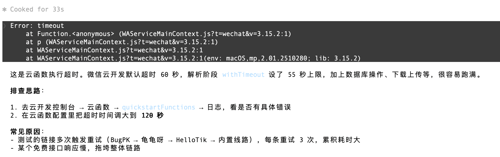

# 报错排查记录

## 1. 点击按钮无反应

**现象**：首页「一键提取视频」「粘贴链接」等按钮点击后没有任何响应。

**排查步骤**：

1. 打开微信开发者工具控制台，看是否有红色报错
2. 最常见原因：`ensureCloudEnv()` 导入后调用方式还是 `this.ensureCloudEnv()`，导致 `TypeError: this.ensureCloudEnv is not a function`
3. 检查 `miniprogram/utils/cloudUtils.js` 是否存在，`ensureCloudEnv` 是否正确导出
4. 检查 `pages/index/index.js` 顶部 import 是否包含 `const { ensureCloudEnv, CLOUD_FUNCTION_NAME } = require("../../utils/cloudUtils")`
5. 确认云环境 ID 已在 `miniprogram/app.js` 的 `globalData.env` 中配置

**解决方法**：所有页面中 `this.ensureCloudEnv()` 改为 `ensureCloudEnv()`，`this.getActionName()` 改为 `getActionName()`，`this.getJobStatusLabel()` 改为 `getJobStatusLabel()`。

---

## 2. 云函数调用返回 unknown type

**现象**：前端操作后提示 `unknown type: xxx`，功能不可用。

**排查步骤**：

1. 确认云函数已重新部署。代码修改后必须右键 `cloudfunctions/quickstartFunctions` → 上传并部署：云端安装依赖
2. 检查 `cloudfunctions/quickstartFunctions/index.js` 的 `switch (event.type)` 中是否有对应的 `case`
3. 检查前端调用时传递的 `type` 字段与云函数 `case` 的大小写是否一致

**解决方法**：部署云函数，确认拼写一致。

---

## 3. 解析后视频不显示

**现象**：任务状态显示「已完成」，但视频预览区域没有出现。

**排查步骤**：

1. 首页任务面板里查看结果消息，判断是哪种失败：
   - 「云端下载失败：域名...HTTP 403」→ B站 Akamai 防盗链拦截，当前方案成功率有限
   - 「云端上传失败」→ 微信云存储上传出错
   - 「视频过大超过云端上限」→ 文件超过 20MB（标准版）
2. B站链接建议在 BugPK 可用时测试，或用抖音/快手短视频验证完整流程
3. 检查云函数日志：云开发控制台 → 云函数 → quickstartFunctions → 日志

**解决方法**：抖音/快手短视频在 BugPK 正常时流程完整（解析→预览→下载→保存）。B站为已知降级场景，详见 `ROADMAP.md`。

---

## 4. VS Code 误报 CSS/WXML 错误

**现象**：`.wxss` 文件显示 `at-rule or selector expected` 等红色波浪线，但微信开发者工具里编译正常。

**原因**：VS Code 内置 CSS linter 不识别微信小程序的 `.wxss` 文件和 `rpx` 单位。

**解决方法**：项目 `.vscode/settings.json` 已配置 `"css.validate": false` 关闭内置校验。如果仍然误报，检查 VS Code 是否安装了其他 CSS 插件（如 Stylelint），需单独配置规则。

---

## 5. 云函数部署后依赖缺失

**现象**：云函数调用返回 `Cannot find module 'axios'` 或类似错误。

**排查步骤**：

1. 检查 `cloudfunctions/quickstartFunctions/package.json` 是否包含所需依赖
2. 部署时是否勾选了「云端安装依赖」
3. 如果新增了子目录（如 `parsers/`、`media/`），确认 `package.json` 放在 `quickstartFunctions/` 根目录

**解决方法**：右键云函数 → 上传并部署：云端安装依赖。如果依赖正确但仍有问题，在云开发控制台查看云函数日志中的具体错误。

---

## 6. 云函数调用超时

**现象**：Console 中调用云函数后返回 `Error: timeout`，堆栈指向 `WAServiceMainContext.js`。

**原因**：视频解析链路涉及多供应商 retry（BugPK → 龟龟呀 → HelloTik → 内置线路），各重试 3 次，外加数据库操作和下载上传，可能在默认 60 秒内未能完成。

**排查步骤**：

1. 先确认是否所有调用都超时，还是仅特定链接：换个已跑通的短链接（如快手短链）再试
2. 查看云函数日志：云开发控制台 → 云函数 → quickstartFunctions → 日志，确认卡在哪个环节
3. 若是免费接口响应慢，可通过环境变量跳过慢接口（如 `BUGPK_DISABLE=1` 跳过 BugPK）

**解决方法**：

- 临时：云开发控制台 → 云函数 → quickstartFunctions → 配置 → 超时时间调大到 **120 秒**
- 长期：配置 `VIDEO_PARSE_URL` 商用解析接口（单次请求、响应快），减少多线路 fallback 耗时

